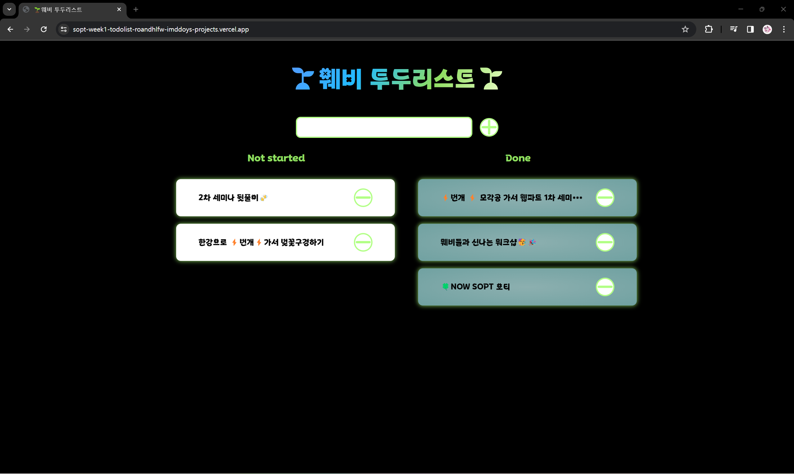

### 🧩 기본 과제2

🔗 [투두리스트 바로가기](https://sopt-week1-todolist-roandhlfw-imddoys-projects.vercel.app/)

1. **간단 구현**

   - [x] todoList의 제목 생성
   - [x] todolist를 입력할 수 있는 input 커스텀
     - [x] 버튼과 input은 가로 정렬

2. **todoList**
   - [x] todoList 말줄임표 처리
   - [x] 삭제버튼 오른쪽 정렬
3. **CSS**
   - [x] 멈추지 않는 animation 적용
   - [x] 그라데이션 색상 한 곳이상 적용
   - [x] 폰트 적용
